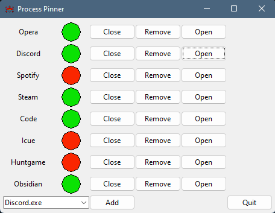
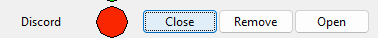

# 🧩 Process Pinner

**Process Pinner** is a lightweight Windows application that lets you monitor, manage and quickly reopen specific processes you care about.

---

##  Features

- View currently active Windows processes
- Add processes to a **monitored list**
- See live status (running / not running)
- **Close**, **Reopen**, or **Remove** monitored processes
- Auto-refresh every second
- Persistent storage in a local JSON file

---

##  Screenshots

  
_Add running process to monitor_

  
_Live status tracking & control options_

  
_Close / Remove / Open from monitored list_

---

##  Data Storage

Your monitored processes are stored in:

C:\Users\<YourName>\AppData\Local\Process Pinner\monitoredProcesses.json

---

##  Requirements

- Tested on **Windows 11**
- Likely compatible with **Windows 10**
- Python 3.13 (for build)

---

##  Usage

Just launch the precompiled `.exe` in the `/dist/` folder:

```Powershell
./dist/ProcessPinner.exe
```


## Developer Setup

To run the project manually:
```Powershell
python -m venv .venv
.\.venv\Scripts\activate
pip install -r requirements.txt
python main.py
```

## App Structure

|Module|Responsibility|
|---|---|
|`ProcessAppUI`|Tkinter-based graphical interface|
|`ProcessMonitor`|Logic for tracking and managing state|
|`config.py`|Constants & defaults|
|`utils.py`|Path helpers & build utilities|

---

##  Python Packages Used

- `tkinter` – GUI
    
- `psutil` – Process handling
    
- `subprocess` – Executing `.exe` files
    
- `os`, `sys` – Path management
    

---

##  Build with PyInstaller

To create a standalone `.exe`:

`pyinstaller main.py --onefile --noconsole --add-data "assets;assets" --add-data "data;data"`

---

##  Credits

Made by Wenzel Hünting 